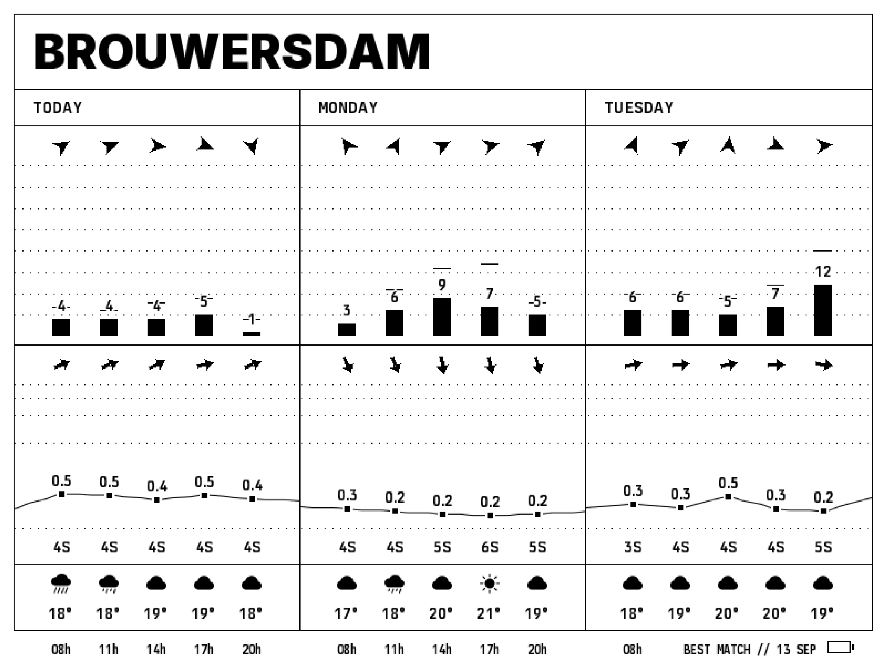
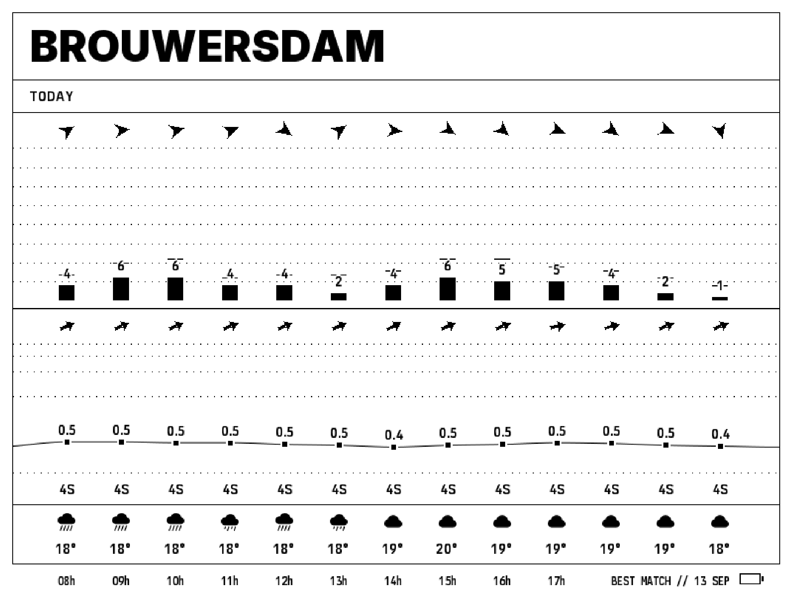

# E1003 hourly detail release

Tapping below the spot title expands the selected visible day into hourly observations from 08:00 through 20:00. Tapping again restores the three-day dashboard. The whole title opens the spot overview. Expansion uses cached observations, preserves module heights, and retains the selected date across sleep. The landing-page comparison calls this “Hourly detail”.

Existing forecast caches migrate without losing their five original observations. Intermediate hours remain unavailable until a normal forecast refresh supplies them. The web renderer input contract and other display profiles retain their existing defaults.

## Renderer evidence

These images were rendered from the release source with the previously captured Brouwersdam forecast for 13 September 2026. Both runs report zero clipped primitives.

## Verification

- 318 firmware host tests passed, including navigation, cache migration, touch gestures and rendering.
- Web unit tests passed after updating the comparison-table expectation for the new row.
- E1003 firmware built with ESP-IDF 6.0.2.
- The shared WebAssembly renderer reproduces byte-for-byte with Emscripten 4.0.10.
- Production web builds passed with and without the nearby-location URL.
- Installer manifest tests and spot-catalog validation passed.
- Review fixes cover C linkage, chronological hourly validation, migrated-cache data, retained redraw state, failed gesture-status recovery and the debug sleep override.
- Inline review preserved the release's runtime locking, navigation wake notifications and repeated spot-limit feedback.

Physical touch, gesture wake, sleep current and on-device memory remain unverified in this release session. The separate [double-tap wake checklist](e1003-touch-doze.md) records the hardware checks.
