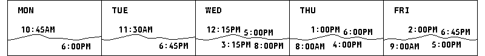
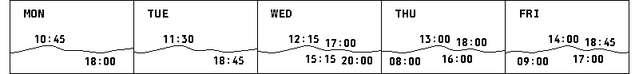
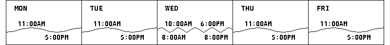

# Tide-label verification

The label layout must retain the maximum number of times that fit within a day column, allowing up to 24 pixels of movement from the existing edge-clamped position and a six-pixel gap. High and low rows are independent. Omitting a label does not change the curve or event data.

## Captured Falmouth data

Captured on 14 September 2026 from [Open-Meteo Marine](https://marine-api.open-meteo.com/v1/marine?latitude=41.55&longitude=-70.61&hourly=sea_level_height_msl&minutely_15=sea_level_height_msl&timezone=America%2FNew_York&forecast_days=5&timeformat=unixtime&cell_selection=sea). The hourly curve and extrema come from the same response. The committed `firmware/host_tests/tide_falmouth_fixture.h` freezes that data so tests do not depend on a changing forecast.

These images show only the day headings and tide region from the native E1002 renderer. They are not a screenshot of a live device. Dates are 14–18 September 2026, America/New_York.

| Day | High times in displayed window | Low times in displayed window | Expected / visible |
|---|---|---|---|
| Monday | 10:45 | 18:00 | 2 / 2 |
| Tuesday | 11:30 | 18:45 | 2 / 2 |
| Wednesday | 12:15, 17:00 | 15:15, 20:00 | 4 / 4 |
| Thursday | 13:00, 18:00 | 08:00, 16:00 | 4 / 4 |
| Friday | 14:00, 18:45 | 09:00, 17:00 | 4 / 4 |

All 16 times are retained in both clock formats. Events outside the existing displayed-hour window are not counted.

### 12-hour clock

### 24-hour clock

## Synthetic crowding test

Wednesday deliberately uses a four-hour wave: highs at 10:00, 14:00 and 18:00; lows at 08:00, 12:00, 16:00 and 20:00. Unlike the initial QA example, the hourly curve and labels describe the same extrema. This is a stress case, not an actual tide prediction.

Only two labels per row fit. Wednesday retains high times 10:00 and 18:00 and low times 08:00 and 20:00. The other three labels are omitted; every peak and trough remains. The other four days retain their two labels: 12 of 15 times are visible overall.

## Automated checks

- 2,000 deterministic cases compare the selected count against an independent exhaustive search through every subset. Both 12- and 24-pixel movement limits are checked, along with spacing, day boundaries and movement bounds.
- The full Falmouth fixture checks that each of the 16 expected times changes the rendered pixels, in both clock formats and both legacy and modular layouts.
- The web renderer repeats the crowded Wednesday case for E1002 and E1003 in both clock formats and both layouts.
- Existing dense, mixed-width, unordered-input, opposite-row and uncrowded-position regressions remain.

The previous greedy selector failed the exhaustive check (two times shown where three fit). The previous 12-pixel limit failed the captured Falmouth case by hiding Wednesday's 20:00 low. Both regression tests now pass. No physical-device test was performed.
