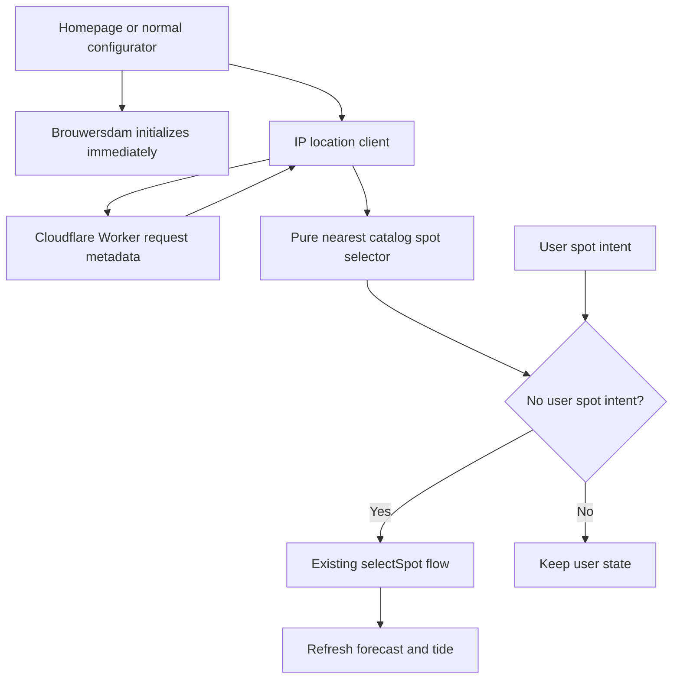
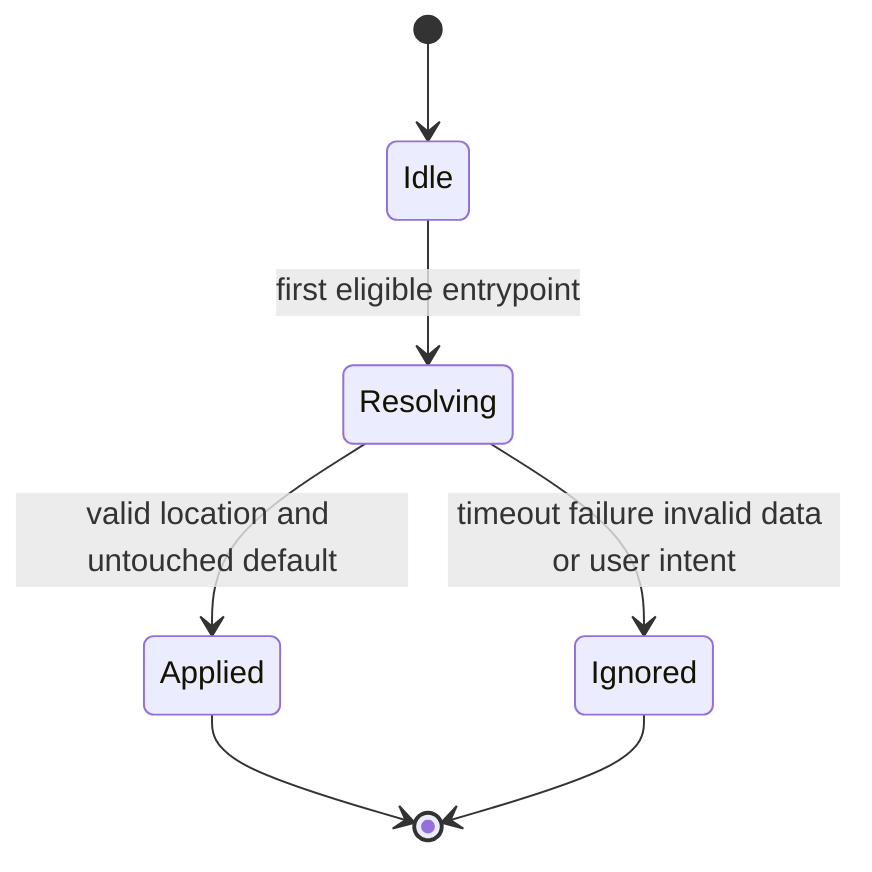

# Nearby Default Spot - Plan

## Goal Capsule

- **Objective:** A new visitor sees a relevant Windpeek forecast from nearby instead of the fixed Brouwersdam example.
- **Means:** Resolve approximate IP location through a small Cloudflare Worker, then select the nearest bundled spot through the shared configurator store (KTD1-KTD4).
- **Product authority:** This only replaces the automatic Brouwersdam default; it does not make a spot choice on the user's behalf once they interact.
- **Open blockers:** None.

---

## Product Contract

### Summary

On the homepage and in the normal configurator, Windpeek will replace Brouwersdam with the nearest catalog spot after approximate IP location becomes available.
The experience remains immediate and silent without adding badges, explanations, popups, or other interface.

### Problem Frame

Every new visitor currently sees Brouwersdam, including visitors far outside the Netherlands.
That makes Windpeek feel like a local Dutch demo instead of a product with worldwide spot support.

### Key Decisions

- **Approximate IP location** (session-settled: user-approved — chosen over browser geolocation: it avoids a permission prompt). Governs R2, R3, R8.
- **Brouwersdam renders first** (session-settled: user-directed — chosen over waiting for location: the page should appear immediately). Governs R1, R6.
- **No remembered spot** (session-settled: user-directed — chosen over persistence: repeating detection on each fresh load is simplest). Governs R7.
- **Detected spot stays separate from search** (session-settled: user-directed — chosen over filling the search field: the field should only contain user input). Governs R4, R5.

### Requirements

**Automatic default**

- R1. A fresh homepage or normal configurator load initially renders the existing Brouwersdam default without waiting for location detection.
- R2. Windpeek obtains an approximate visitor coordinate from IP without requesting browser location permission.
- R3. When a usable coordinate is returned, Windpeek selects the geographically nearest spot from its bundled catalog.
- R4. The detected spot becomes the active forecast spot and loads the same live forecast and tide data as a manually selected spot.

**Interaction and fallback**

- R5. The configurator's search input remains empty until the user types, even when a nearby default spot is active.
- R6. Missing, invalid, slow, or failed location detection leaves Brouwersdam active without blocking the page or showing an error.
- R7. Windpeek does not persist the detected nearby spot and determines it again on each fresh page load.
- R8. A location result that arrives after the user has selected or edited a spot cannot override that interaction.

**Experience consistency**

- R9. Homepage and normal configurator use the same nearby-default behavior and resolve the same catalog spot for the same coordinate.
- R10. The automatic replacement adds no badge, explanation, popup, or other new visible interface.

### Key Flows

- F1. Nearby default resolves
  - **Trigger:** A visitor opens the homepage or configurator.
  - **Steps:** Brouwersdam renders immediately; approximate IP coordinates arrive; Windpeek finds the nearest catalog spot; its live forecast and tide replace the initial data.
  - **Outcome:** The visitor sees a nearby forecast without taking action.
  - **Covered by:** R1-R4, R9, R10.
- F2. Detection cannot provide a default
  - **Trigger:** Location detection fails, returns unusable data, or never completes.
  - **Steps:** The initial Brouwersdam state remains unchanged.
  - **Outcome:** Windpeek stays usable without an interruption or error state.
  - **Covered by:** R1, R6.
- F3. User acts before detection completes
  - **Trigger:** The visitor searches for or selects a spot while location detection is pending.
  - **Steps:** Windpeek marks the user's interaction as authoritative and ignores the late location result.
  - **Outcome:** The interface never jumps away from the user's choice.
  - **Covered by:** R5, R8.

### Acceptance Examples

- AE1. **Covers R1-R4.** Given a visitor near Tarifa opens the homepage, when IP location resolves successfully, then Brouwersdam appears first and is replaced by the nearest catalog spot with its forecast and tide.
- AE2. **Covers R5.** Given a nearby default is active in the configurator, when the user has not typed, then the search field is empty.
- AE3. **Covers R6.** Given the location request fails, when the page finishes loading, then Brouwersdam remains visible and the visitor sees no location error.
- AE4. **Covers R8.** Given the user selects another spot before location detection completes, when the IP result arrives, then the selected spot remains active.
- AE5. **Covers R7, R9.** Given the same visitor starts a new page load, when location detection succeeds, then the nearby spot is calculated again using the same behavior on both surfaces.

### Scope Boundaries

- Browser geolocation and its permission prompt are excluded.
- Remembering the detected spot between page loads is excluded.
- Filling the search field with the detected spot is excluded.
- Adding location copy, controls, consent UI, badges, or animations is excluded.
- Adding new spots or changing catalog quality is excluded.
- Custom coordinates outside the existing catalog are excluded.
- Device-preview and installer-demo configurator modes remain fixed to Brouwersdam.
- Location is only a soft default; it is not presented as the visitor's exact position.

### Dependencies and Assumptions

- The bundled catalog remains the authority for selectable spots and includes the coordinates needed for nearest-distance comparison.
- A small Cloudflare endpoint can return approximate latitude and longitude from request metadata while the site continues to use its existing static hosting flow.
- IP location may be inaccurate because of VPNs, mobile networks, or provider routing; this is acceptable because users can immediately choose another spot.

### Sources and Research

- Default spot and catalog: `web/src/spots.js`, `web/src/spots/catalog.generated.json`
- Spot selection and forecast refresh: `web/src/stores/configurator.js`
- Homepage initialization: `web/src/components/LandingHero.vue`
- Configurator initialization: `web/src/views/ConfiguratorView.vue`
- Separate selected-spot and search state: `web/src/components/WindpeekSettings.vue`
- Conditional GitHub Pages deployment: `.github/workflows/firmware-release.yml`
- Cloudflare request location fields: https://developers.cloudflare.com/workers/runtime-apis/request/
- Cloudflare geolocation example: https://developers.cloudflare.com/workers/examples/geolocation-hello-world/

---

## Planning Contract

### Product Contract Preservation

Product Contract unchanged.

### Key Technical Decisions

- KTD1. **Keep nearest-spot selection pure and catalog-bound.** A dedicated browser-independent helper validates coordinates, calculates Haversine distance across bundled `SPOTS`, and keeps catalog order as the deterministic tie-breaker. Governs R3, R9.
- KTD2. **Use a separate Cloudflare Worker as the only IP-location boundary** (session-settled: user-approved — chosen over browser geolocation and a hosting migration: it avoids permission UI while keeping the existing static site). The Worker accepts `GET`, returns only approximate coordinates, allows credential-free browser access through wildcard CORS, and sends `Cache-Control: no-store` on every response. Wildcard CORS is intentional because each caller receives only its own approximate location and origin filtering would not prevent direct quota abuse. Governs R2, R6, R10.
- KTD3. **Let the Pinia store own nearby-default orchestration.** One idempotent action coordinates the location request, nearest selection, and existing `selectSpot()` refresh path for both entrypoints. Governs R3, R4, R7, R9.
- KTD4. **Protect user intent with one store-level boolean.** A dedicated combobox user-input signal and explicit manual spot actions set `hasUserSpotIntent`; programmatic label restoration and automatic selection do not. Nearby detection applies only while this value is false and Brouwersdam remains active. Governs R5, R8.
- KTD5. **Bound detection to one concurrency-safe three-second attempt per store lifetime.** The store enters resolving state before starting the request, so overlapping initializers share one attempt. Three seconds is the visible-change deadline rather than a network availability target; after it, keeping Brouwersdam is less disruptive than a late page jump. Missing configuration, invalid data, errors, and timeout all resolve silently to the existing fallback. Governs R1, R6, R7.
- KTD6. **Keep deterministic preview modes outside detection.** Device-preview and installer-demo routes retain Brouwersdam fixtures so generated assets and automated demonstrations do not depend on runner location. Governs R9, R10.

### High-Level Technical Design

### System-Wide Impact

- **Browser:** Homepage and normal configurator add one short best-effort request after their existing immediate render.
- **Store:** Automatic and manual spot changes share the existing forecast and tide refresh path, while only manual intent sets the protection flag.
- **Deployment:** The static build receives the deployed Worker URL through a GitHub Actions repository variable.
- **Privacy posture:** Windpeek stores no location and sends no browser GPS coordinate; Cloudflare derives an approximate coordinate from request metadata.

### Risks and Dependencies

- Mobile networks, VPNs, and ISP routing can produce an imperfect default. Manual spot search remains authoritative.
- The Worker must be deployed before its URL is configured for the static build. An absent URL keeps Brouwersdam and does not block local development or deployment.
- Every Worker response must send `Cache-Control: no-store` because coordinates vary by requester and should not persist in browser caches.
- Worker observability and invocation logging must be disabled, and application code must not log request or location data.
- A delayed Brouwersdam forecast may finish after nearby selection. Existing forecast and tide request IDs must continue to reject stale results.

### Sequencing

1. Add and verify the pure location and distance boundaries.
2. Add store orchestration and user-intent protection.
3. Connect eligible homepage and configurator entrypoints.
4. Add deployment configuration and cross-surface browser coverage.

---

## Implementation Units

### U1. Nearest spot and IP location clients

- **Goal:** Provide deterministic nearest-catalog selection and a silent browser client for approximate IP coordinates.
- **Requirements:** R2, R3, R6, R7, R9.
- **Dependencies:** None.
- **Files:** `web/src/spots/nearestSpot.js`, `web/src/location/ipLocation.js`, `web/tests/nearest-spot.test.js`, `web/tests/ip-location.test.js`.
- **Approach:** Follow KTD1 and KTD5. Keep coordinate validation shared between the response boundary and distance calculation. Read the endpoint from the Vite environment and return no location when it is absent or unusable.
- **Test scenarios:**
  1. An exact catalog coordinate returns that spot.
  2. Nearby coordinates return the closest candidate across normal and antimeridian cases.
  3. Equal distances keep stable catalog order.
  4. Non-finite and out-of-range coordinates return no spot.
  5. A valid endpoint response returns numeric coordinates.
  6. Missing endpoint, non-success response, malformed JSON, invalid coordinates, abort, and three-second timeout return no location without throwing.
- **Verification:** Both helpers are deterministic, have no storage side effects, and fail closed to no result.

### U2. Cloudflare location boundary

- **Goal:** Supply approximate request coordinates without moving the website away from static hosting.
- **Requirements:** R2, R6, R10.
- **Dependencies:** None.
- **Files:** `workers/nearby-location/src/index.js`, `workers/nearby-location/wrangler.jsonc`, `workers/nearby-location/package.json`, `workers/nearby-location/package-lock.json`, `web/tests/nearby-location-worker.test.js`.
- **Approach:** Follow KTD2. Keep the Worker stateless and return only the fields the browser needs. Handle unsupported methods, missing Cloudflare metadata, wildcard CORS, and preflight without logging or persistence. Disable Worker observability and invocation logs in configuration.
- **Execution note:** Start with request-contract tests before adding the Worker handler.
- **Test scenarios:**
  1. A `GET` with valid Cloudflare coordinates returns only numeric latitude and longitude.
  2. A `GET` without usable coordinates returns an unavailable response with no location body.
  3. Preflight returns the required CORS headers.
  4. Unsupported methods do not expose request metadata.
  5. Every response sends `Cache-Control: no-store` and wildcard CORS.
  6. Worker configuration disables observability and invocation logs.
- **Verification:** The handler and deployment configuration pass contract tests without storage bindings or secrets.

### U3. Shared nearby-default orchestration

- **Goal:** Apply the nearby default through existing spot selection while preserving user intent and empty search state.
- **Requirements:** R1, R3-R9; F1-F3; AE1-AE5.
- **Dependencies:** U1.
- **Files:** `web/src/stores/configurator.js`, `web/src/components/settings/SettingCombobox.vue`, `web/src/components/WindpeekSettings.vue`, `web/src/components/LandingHero.vue`, `web/src/views/ConfiguratorView.vue`, `web/tests/configurator-store.test.js`, `web/tests/settings-controls.test.js`, `web/tests/settings.test.js`, `web/tests/landing-hero.test.js`, `web/tests/configurator-view.test.js`.
- **Approach:** Follow KTD3-KTD6. Start existing forecast and tide initialization first. Trigger nearby resolution without awaiting it only from the two owning entrypoints. Emit explicit user-input intent from the shared combobox instead of inferring intent from model updates. Mark catalog selection and entering or saving custom-spot creation before asynchronous work begins. Focus, programmatic label restoration, automatic selection, and non-spot settings do not count as spot intent. Treat both `devicePreview` and `installerDemo` as deterministic routes that skip detection.
- **Test scenarios:**
  1. Covers F1 / AE1. Brouwersdam is initial state and a valid nearby result changes the active spot through `selectSpot()`.
  2. Covers F2 / AE3. Failure and timeout leave Brouwersdam and do not alter initialization status.
  3. Repeated and simultaneous nearby initializers perform only one location request per store lifetime.
  4. Covers F3 / AE4. Typing, clearing, selecting, or opening custom-spot creation before completion sets user intent and makes the late result a no-op.
  5. Covers AE2. Automatic selection changes the active spot while the search input stays empty.
  6. Device-preview and installer-demo modes skip location resolution.
  7. Stale Brouwersdam forecast and tide responses cannot overwrite the nearby spot's data.
- **Verification:** Homepage and normal configurator share one store action, while deterministic special routes and manual spot behavior remain unchanged.

### U4. Release wiring and browser acceptance

- **Goal:** Make the deployed static site consume the Worker safely and prove the complete visible behavior.
- **Requirements:** R1-R10; F1-F3; AE1-AE5.
- **Dependencies:** U1-U3.
- **Files:** `.github/workflows/firmware-release.yml`, `web/playwright.config.js`, `web/tests/e2e/configurator.spec.js`, `web/tests/e2e/landing.spec.js`, `docs/release.md`, `workers/nearby-location/README.md`.
- **Approach:** Pass the location endpoint into production builds through a repository variable. Keep the variable optional so missing deployment preserves Brouwersdam. Run Worker contract tests through the existing web Vitest suite instead of adding a second test runner. Use a controlled test endpoint in browser tests to prove the initial render, later replacement, empty search input, failure fallback, and user-interaction race.
- **Test scenarios:**
  1. Covers AE1. A delayed test response proves Brouwersdam renders before a nearby spot replaces it on the homepage.
  2. Covers AE2. The same replacement in the configurator leaves spot search empty.
  3. Covers AE3. A failed test endpoint leaves Brouwersdam with no location error UI.
  4. Covers AE4. Typing before the delayed response prevents automatic replacement.
  5. A production build succeeds with and without the optional endpoint variable.
- **Verification:** Browser tests prove both entrypoints and release documentation identifies Worker-first deployment ordering and the required repository variable.

---

## Verification Contract

| Scope | Command | Required signal |
|---|---|---|
| Focused unit coverage | `cd web && npx vitest run tests/nearest-spot.test.js tests/ip-location.test.js tests/nearby-location-worker.test.js tests/configurator-store.test.js tests/settings.test.js tests/landing-hero.test.js tests/configurator-view.test.js` | Location, distance, store-race, search, and entrypoint scenarios pass. |
| Web regression suite | `cd web && npm test` | Existing and new Vitest coverage passes. |
| Browser acceptance | `cd web && npm run test:e2e` | Homepage and configurator nearby-default flows pass in Chromium. |
| Catalog integrity | `cd web && npm run spots:catalog:check` | Bundled catalog remains valid and unchanged unless intentionally regenerated. |
| Production build | `cd web && npm run build` | Static assets build with optional location endpoint configuration. |

---

## Definition of Done

- Brouwersdam appears immediately on a fresh homepage and normal configurator load.
- A valid IP-derived coordinate replaces it with the nearest bundled catalog spot within the detection window.
- Forecast and tide refresh for the nearby spot through existing guarded request flows.
- Search remains empty until user input.
- Any spot intent prevents a late automatic change.
- Failure, missing configuration, and special preview modes remain deterministic and silent.
- Worker responses expose only coordinates, allow credential-free browser requests, and send `Cache-Control: no-store`.
- Worker observability and invocation logging are disabled.
- The Worker deployment and static-site repository variable are documented.
- Focused tests, the complete web suite, browser acceptance, catalog validation, and production build pass.
- Abandoned experiments and unrelated cleanup are absent from the final diff.
